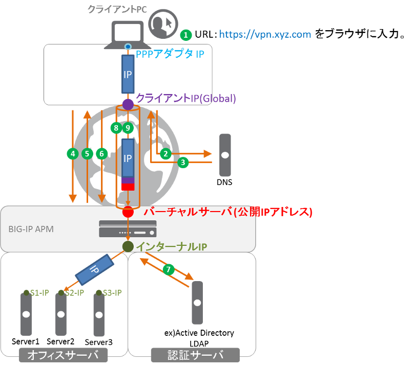

APMネットワークアクセス動作概要
===========================

APMのネットワークアクセスは以下のような流れで動作します。

   APM ネットワークアクセス動作概要

**ネットワークアクセス　処理の流れ**
  

-	クライアントがWebブラウザに、URL：https://vpn.xyz.comを入力。
-	クライアントPCは、vpn.xyz.comのIPアドレスを解決するために、DNSクエリを送信。
-	DNSサーバからvpn.xyz.comのIPアドレスを得る。
-	Webブラウザは、そのIPアドレス（バーチャルサーバ）宛にHTTPSリクエストを送信。
-	BIG-IP APMは、ログインページを表示。
-	クライアントは、ユーザ名とパスワードを入力。
-	BIG-IP APMは認証サーバに問合せを行い、認証が正しく行われたことのレスポンスを得る。
-	BIG-IP APMは、クライアントPCとの間でSSL-VPNトンネルを確立する。このとき、クライアントPCのPPPアダプタには、事前にAPMに設定されたIPアドレスプールの中から一つIPアドレスが払い出される。
  （この後、クライアントPCは、PPPアダプタを使って、オフィスサーバ群へアクセスができるようになる。）
-	PPPアダプタから出たIPパケットは、インターネット上のグローバルIPアドレスでカプセル化（＝トンネル化）され、BIG-IP APMに到着。APMはそのカプセル化を解き、APMのルーティングテーブルに従って、そのカプセル化が解かれたIPパケットを送り出す。

