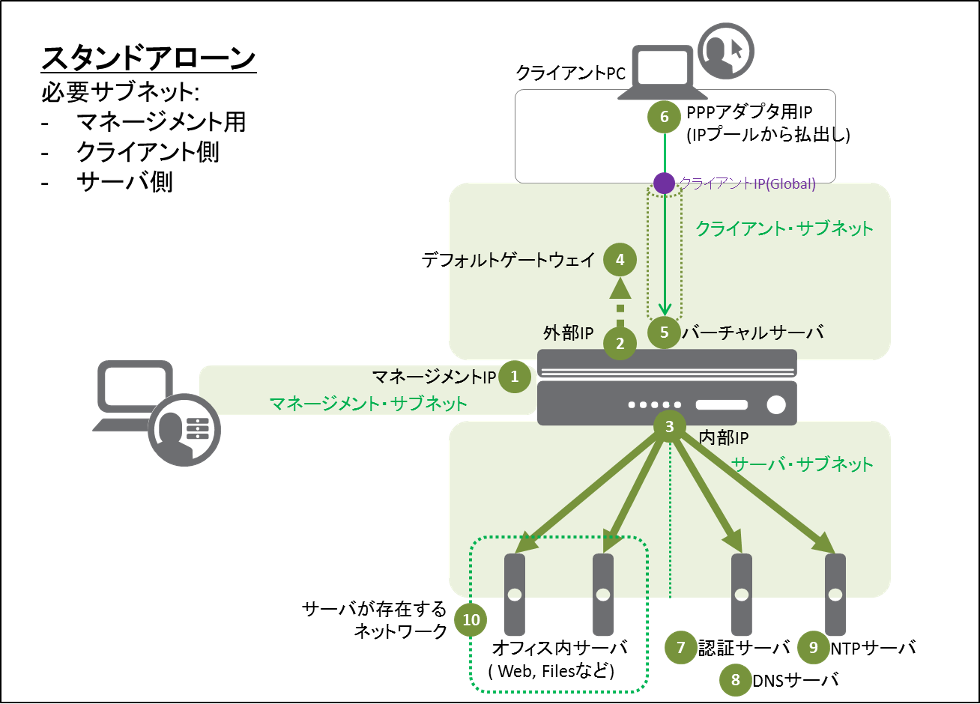

スタンドアローン構成概要
===========================

スタンドアローンイメージ

   APM ネットワークアクセス動作概要

- 上図①～⑨のIPアドレスが必要になりますので、あらかじめご用意ください。
- なお、①管理IPは工場出荷時に192.168.1.245/24がプリセットされています。

** IPアドレス **

.. csv-table::
   :header: "-","項目","名前（サンプル）","値"
   :widths: 10, 30, 30, 30

   "-","ホスト名","bigXXX.f5jp.local","-"
   "①","管理IP","-","10.99.88.XXX/24"
   "②","External インターフェース","external","10.99.1.XXX"
   "③","Internal インターフェース","internal","10.99.2.XXX"
   "④","デフォルトゲートウェイ","default-GW","10.99.1.254"
   "⑤","バーチャルサーバーアドレス","NetAccess-001_vs","10.99.1.ZZZ:443"
   "⑥","PPP アダプタ用 IP アドレスプール","NetAccess-001_ip","10.99.99.11-20"
   "⑦","認証サーバ（Active Directory）","NetAccess-001_aaa_srvr","10.99.2.218"
   "⑧","DNS サーバ（Active Directory）","-","10.99.2.218"
   "⑨","NTP サーバ","-","10.99.2.219"
   "⑩","サーバが存在するネットワーク","-","10.99.100.0/24"

** ユーザ名、パスワード **

.. csv-table::
   :header: "項目","User名","Password"
   :widths: 30, 30, 30
   
   "CLI パスワード（デフォルト）","root","default"
   "GUI パスワード（デフォルト）","admin","admin"