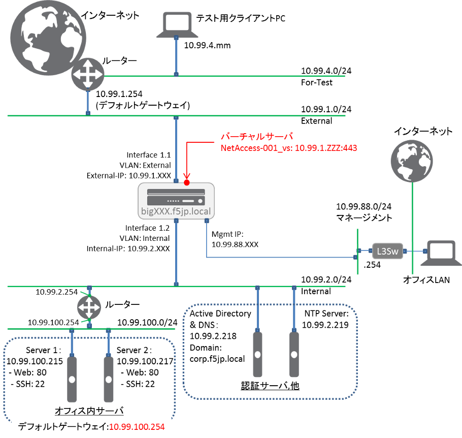

スタンドアローンネットワークサンプル
===========================

冗長化しない状態を想定して、1台のみ設定していきます。

   APM ネットワークアクセス　ネットワークサンプル

BIG-IPのAPMリモートアクセス用Virtual Serverは10.99.1.ZZZ:443とします。
Active Directoryのドメインは、「corp.f5jp.local」とします。

Active Directoryには、以下のユーザが登録されています。

.. csv-table:: ADユーザ情報
  :header: "ユーザー名","パスワード","グループ"
  :widths: 30, 30, 30
  "test1001","test1001","CorpA-Group"
  "test1002","test1002","CorpB-Group"
  "test1003","test1003","CorpC-Group"

- BIG-IPのデフォルトゲートウェイは、インターネット方向を想定したルーター：10.99.1.254に設定します。
- オフィス内サーバのデフォルトゲートウェイは、直上のルーター：10.99.100.254に設定されているものとします。
- 動作確認は、テスト用に設置したPC(図中の「テスト用クライアントPC」)から行うこととします。
