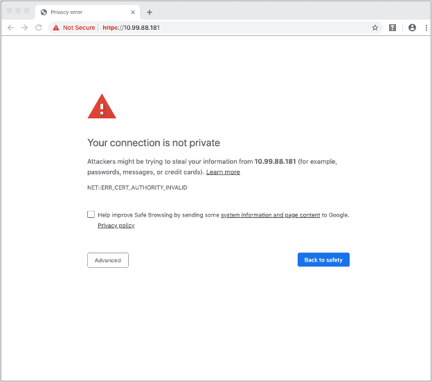
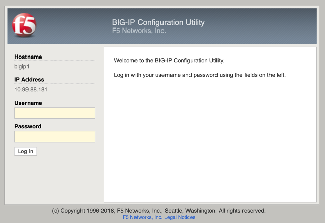
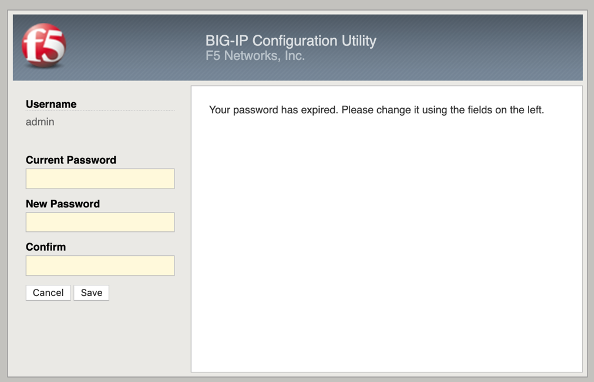
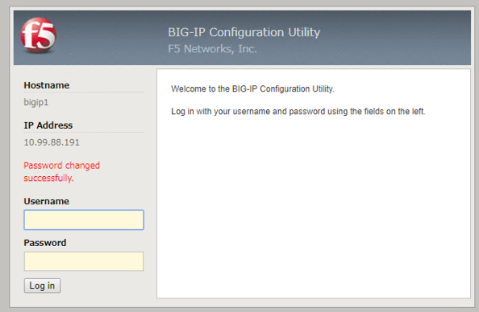
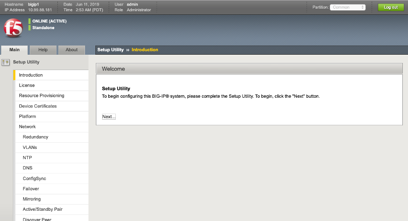
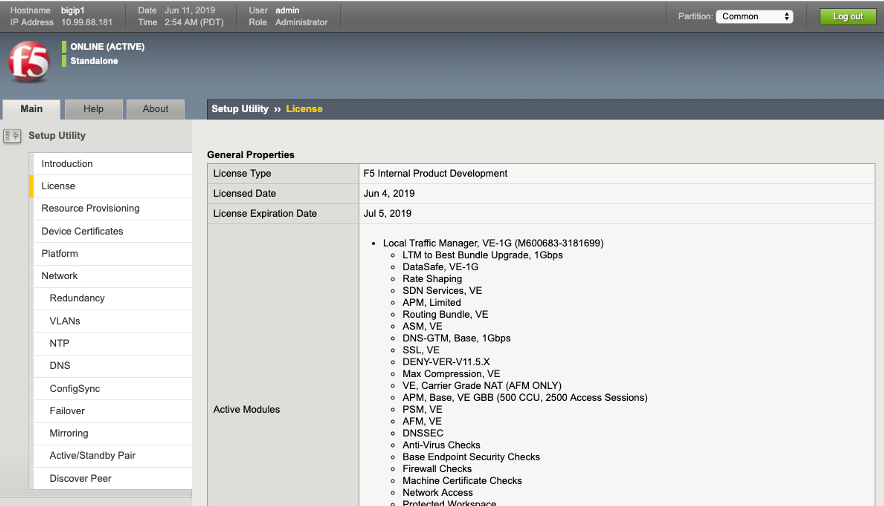
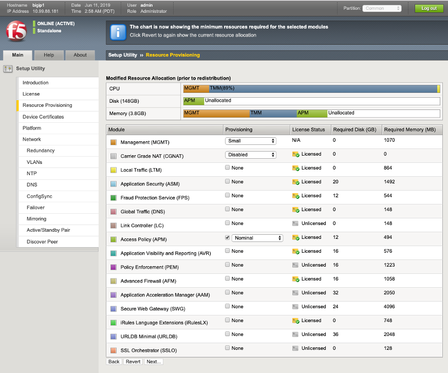
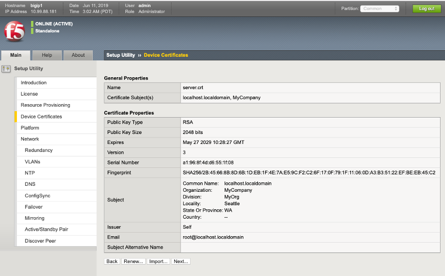
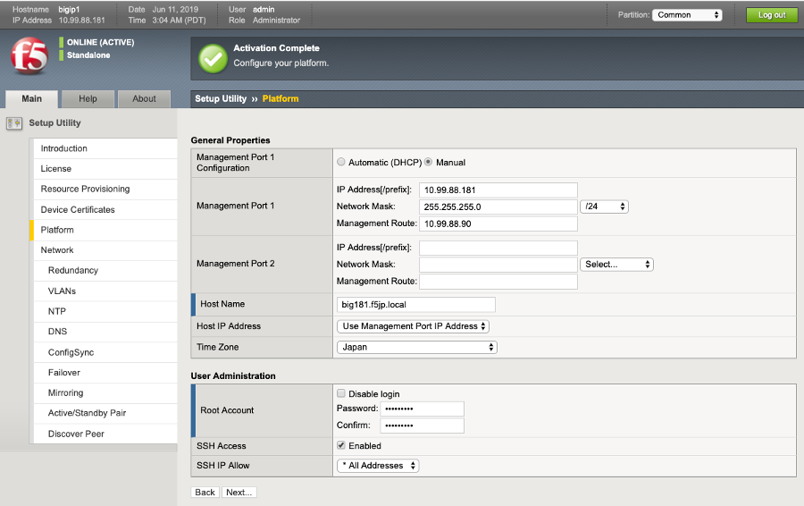
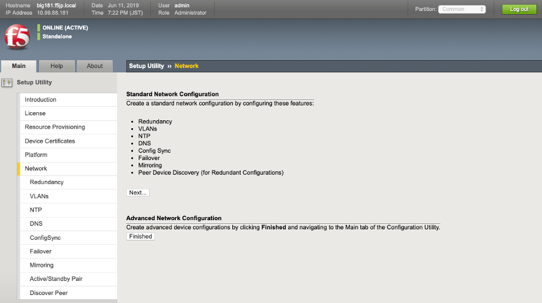

管理ポートへのGUIアクセス
===========================

(1)	管理用PCから、設定したBIG-IPの管理IPアドレスへ、HTTPSでアクセスします。デフォルトの証明書は、正式に取得した証明書ではないため、以下のような画面が現れますが、「続行する」を選択してください。

(2)	ログイン画面が現れますので、以下のデフォルトのIDとPasswordでログインしてください。
ID：admin
Password：admin

(3)	バージョン14.0より、デフォルトでBIG-IPのセキュアパスワードポリシーが有効となっています。パスワードポリシーを変更しない限り、v13.0以前のデフォルトパスワードは利用できません。

F5LABでは以下のように設定し、Saveボタンを押します。
- Current Password: admin
- New Password: ilovef5
- Confirm: ilovef5

(4)	設定したパスワードでログインし直します。

(5)	「Next」ボタンを押します。

(6)	ライセンス画面が出ます。「Next」ボタンを押します。

~中略~

- ライセンスがBIG-IQ License Managerで管理されている場合は、Nextボタンは押せませんので、Resource Provisioningをクリックして下さい。

(7)	プロビジョニング画面がでますので、「APM」にチェックを入れます。「Next」ボタンを押すと再起動の確認がでるので、OKを押します。

(8)	SSL証明書の確認がなされますが、デフォルトのまま、「Next」ボタンを押します。

(9)	ホスト名、タイムゾーン、Rootのパスワードを設定します。「Next」ボタンを押します。

(10)	この後、Standard Network Configurationの「Next」を押すことでウィザード形式にて冗長化も含めた設定が可能ですが、ここではスタンドアローン構成にするため、Advanced Network Configurationの「Finished」ボタンを押します。

