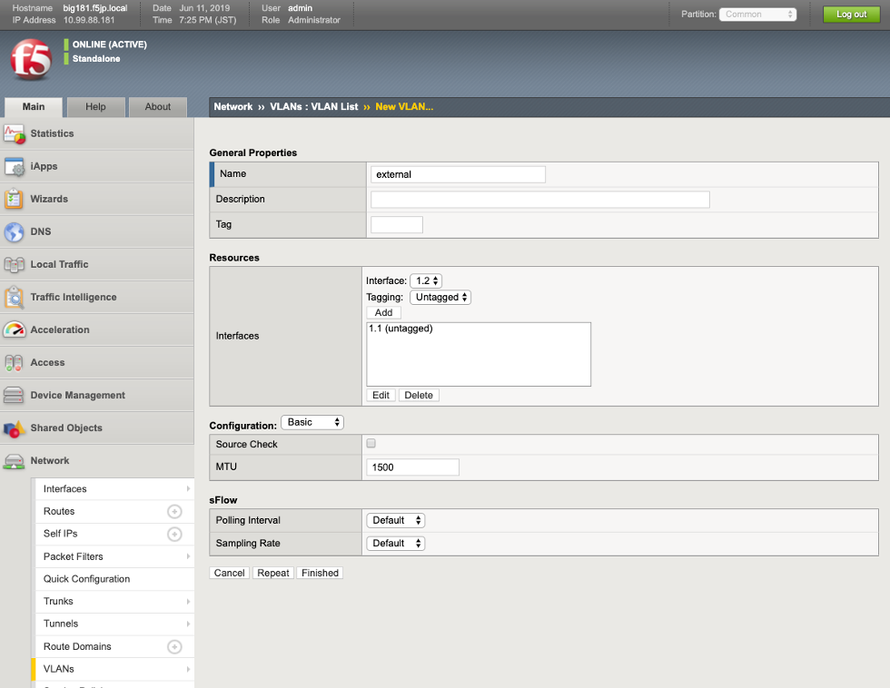
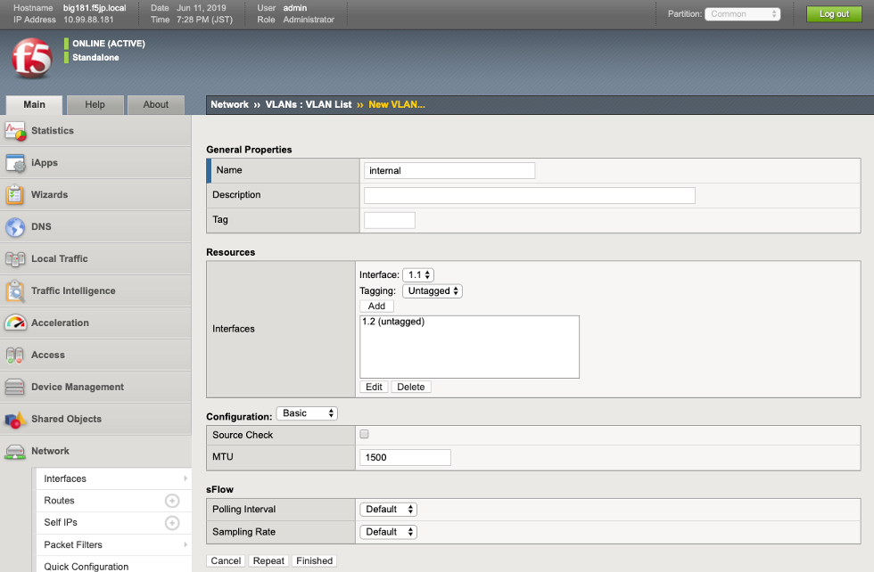
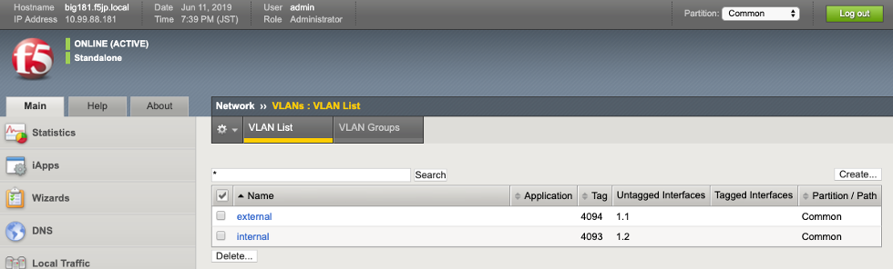

VLANの作成
===========================

(1)	VLANを作成します。 「Network」 → 「VLAN」で表示された画面の右上にある「Create」ボタンを押します。

External VLAN の設定

- Name :名前（任意）を指定
- Interface :1.1を指定
- Tagging : Untaggedを選択し、Addをクリック
- Finishedをクリック

Internal VLAN の設定

- Name :名前（任意）を指定
- Interface :1.2を指定
- Tagging : Untaggedを選択し、Addをクリック
- Finishedをクリック

一覧では上記のようになります。
