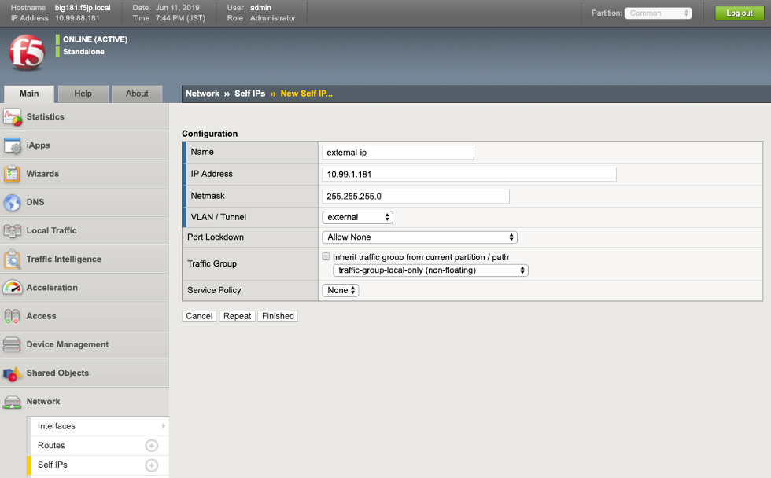
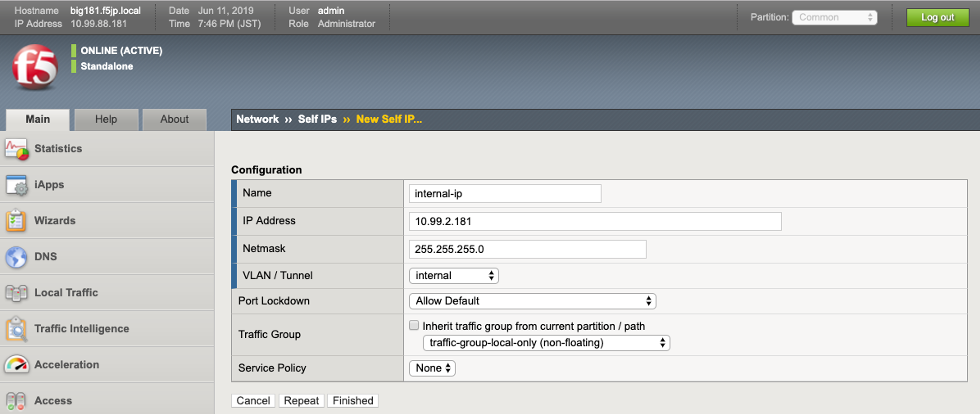
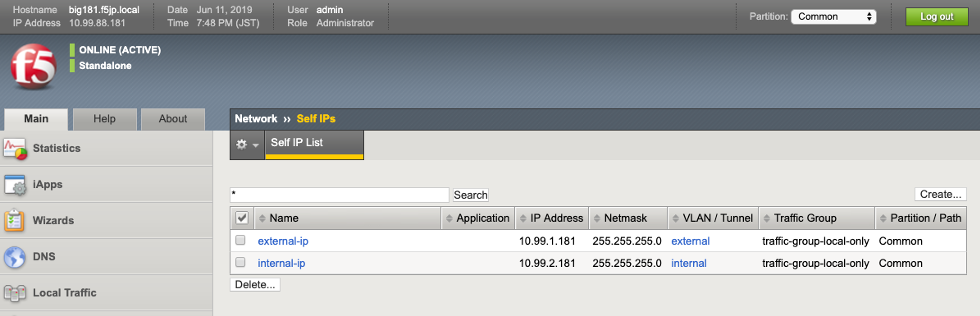

Self IP の作成
===========================

BIG-IPに設定したVLANそれぞれに対して、IPアドレスを設定していきます。
BIG-IP自身に設定するIPアドレスを、Self IPと呼びます。

(1)	「Network」 → 「Self IPs」で表示された画面の右上にある「Create」ボタンを押します。

**External VLAN の IP(Self IP)設定**

- Name :名前（任意）を指定
- IP Address : 10.99.1.XXX(F5ラボの場合) / IPアドレスを指定
- Netmask : 255.255.255.0(F5ラボの場合) / サブネットマスクを指定
- VLAN/Tunnel : VLAN external を選択
- Port Lockdown : Allow None / このアドレス上でのサービス(SSH/GUIアクセス等)を拒否
- Finishedをクリック

**Internal VLAN の IP(Self IP)設定**

- Name :名前（任意）を指定
- IP Address : 10.99.2.XXX(F5ラボの場合) / IPアドレスを指定
- Netmask : 255.255.255.0(F5ラボの場合) / サブネットマスクを指定
- VLAN/Tunnel : VLAN internal を選択
- Port Lockdown : Allow Default / このアドレス上でのサービス(SSH/GUIアクセス等)を許可
- Finishedをクリック

一覧では上記のようになります。
