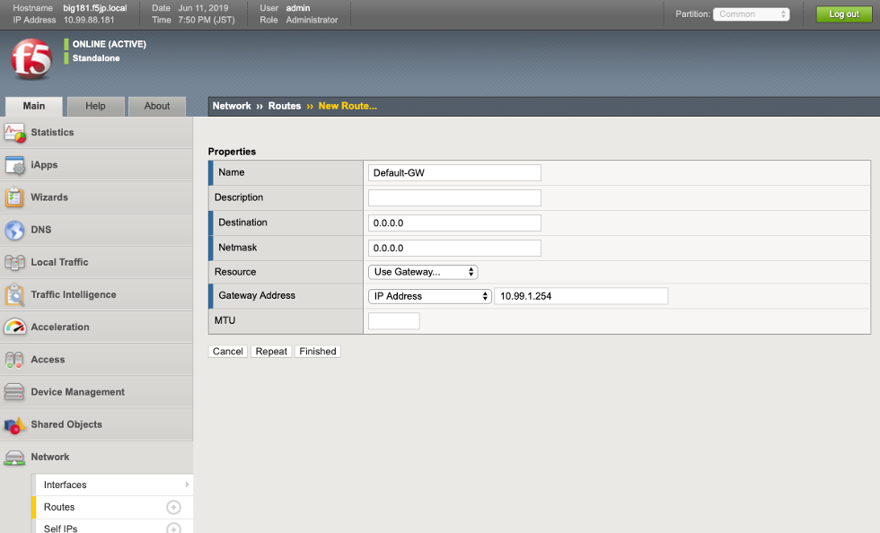
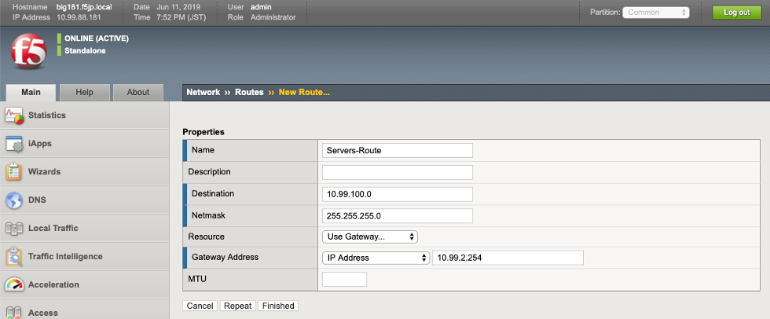
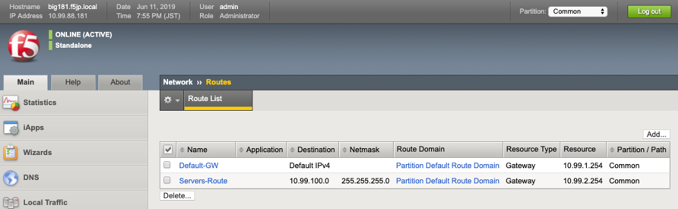

Routing の作成
===========================

- デフォルトゲートウェイの設定

(1)「Network」 → 「Routes」で表示された画面の右上にある「Add」ボタンを押します。以下の通り入力し、「Finished」を押します。

**デフォルトゲートウェイ設定**

- Name :名前（任意）を指定
- Destination : 0.0.0.0 / 宛先ネットワークアドレスを指定(デフォルトゲートウェイの場合、0.0.0.0)
- Netmask : 0.0.0.0 / サブネットマスクを指定
- Gateway Address : 10.99.1.254 / ゲートウェイのアドレスを指定
- Finishedをクリック

- オフィス内サーバへのルーティング設定

(2)BIG-IPからオフィス内サーバ：10.99.100.0/24へ到達するためのルーティングも同様に設定します。

**ルーティング設定**

- Name :名前（任意）を指定
- Destination : 10.99.100.0 / 宛先ネットワークアドレスを指定
- Netmask : 255.255.255.0 / サブネットマスクを指定
- Gateway Address : 10.99.2.254 / ゲートウェイのアドレスを指定
- Finishedをクリック

一覧では上記のようになります。
