ウィザードを使って設定する方法
===========================

(1)「Wizards」 → 「Device Wizards」で、「Network Access Setup Wizerad for Remote Access」を選択し、「Next」を押します。

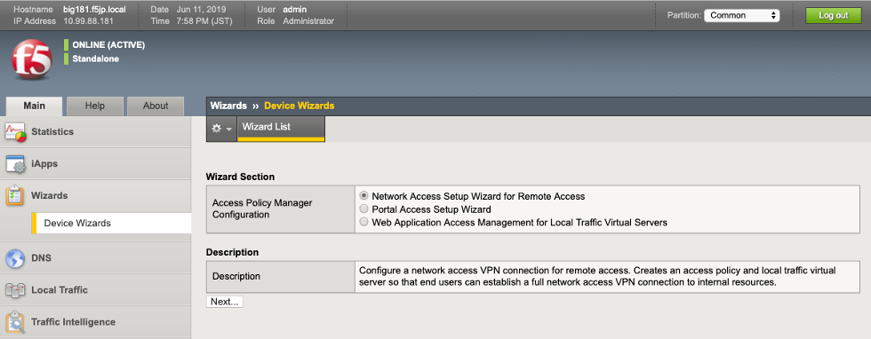

(2)以下の情報を入力 （または選択） し、「Next」を押します。

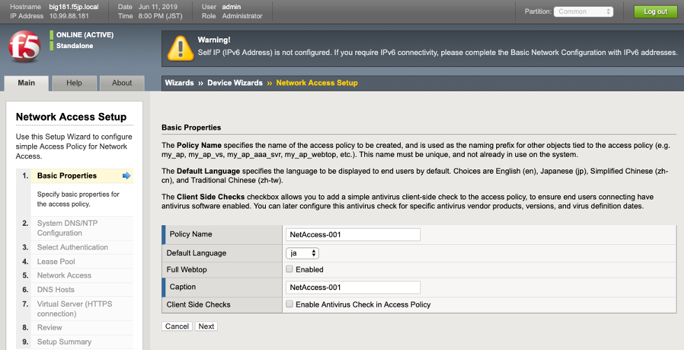

- Name :名前（任意）を指定
- Default Language : ja / クライアントPCで表示される、認証画面の言語選択
- Caption : Name で指定したものが自動で表示される
- Client Side Checks : チェックを外す / ※このチェックボックスを有効にしておくと、クライアントPC内にインストールされているアンチウィルスソフトウェアのチェックが行われます。

(3)DNSとTime Server（NTP）のIPアドレスを入力し、「Next」を押します。

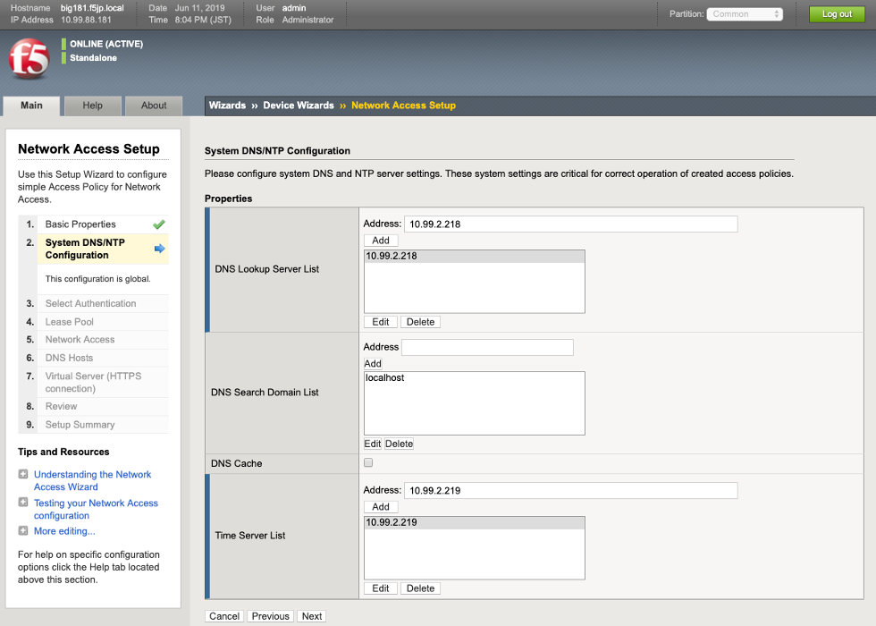

- DNS Lookup Server List : 10.99.2.218 / DNS サーバの IP アドレスを入力し、Add をクリックする
- Time Server List : 10.99.2.219 / NTP サーバの IP アドレスを入力し、Addをクリックする

(4)利用する認証サーバ（Active Directory）を選択し、「Next」を押します。

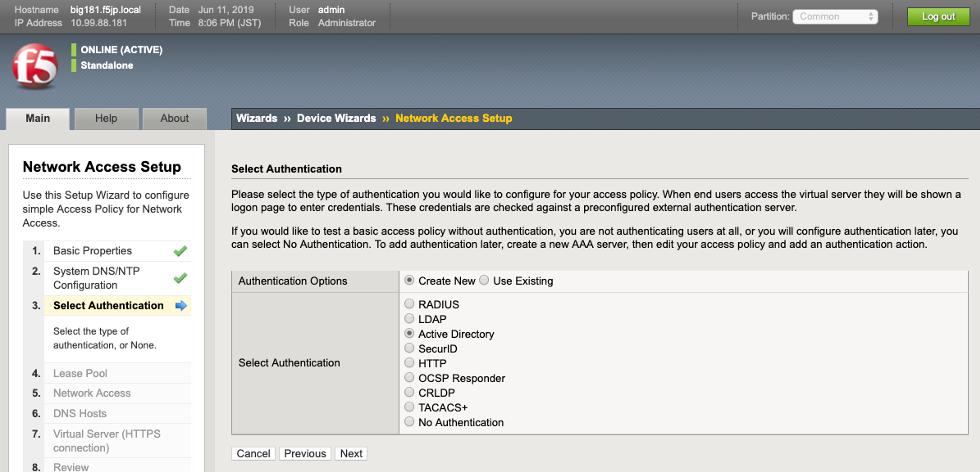

- Authentication Options : Create New を選択
- Select Authentication : Active Directory を選択

(5)Active Directoryによる認証に必要な情報を入力し、「Next」を押します。
- （Local User DBを利用する場合、「No Authentication」を選択しますので、このステップはありません。）

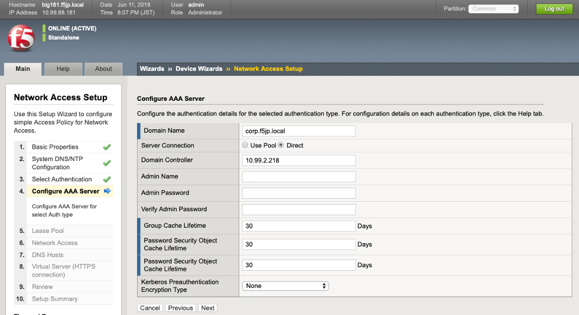

- Domain Name : corp.f5jp.local / ADドメイン名を入力
- Server Connection : Direct
- Domain Controller : 10.99.2.218 / ドメインコントローラの IP アドレスを入力

(6)IPアドレスプールを設定し、「Next」を押します。

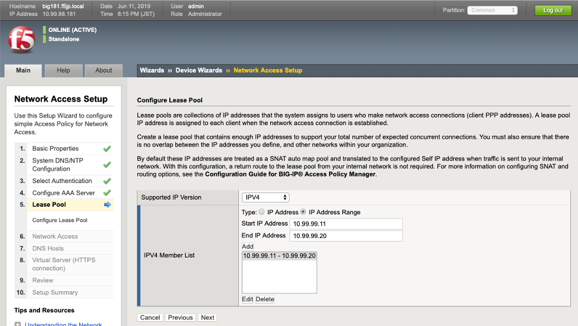

- IPV4 Member List : F5ラボの場合、10.99.99.11-10.99.99.20 を利用する。以下入力しAddをクリックする
- Type : IP Address Range を選択 / クライアントPCの PPP アダプタに割り当てられる
- Start IP Address : 10.99.99.11
- End IP Address : 10.99.99.20

(7)「Use split tunneling for traffic」を選択し、「Next」を押します。

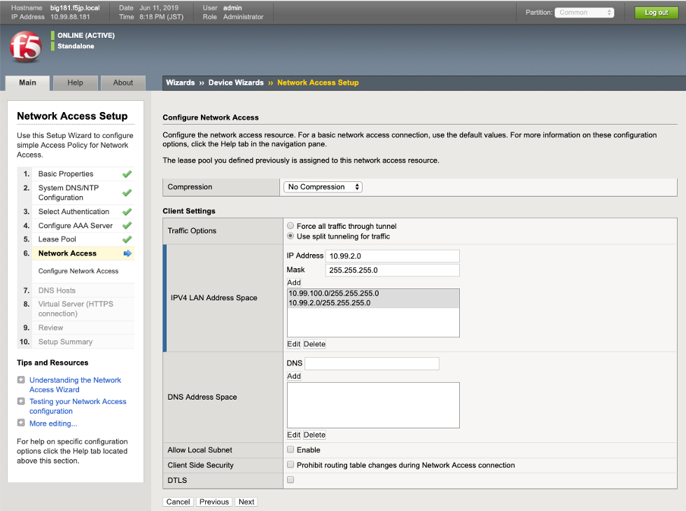

- Traffic Options : Use split tunneling for traffic を選択
- IPV4 LAN Address Space : F5ラボの場合、以下の通り入力し、Addをクリックする
- IP Address : 10.99.2.0 / PPPアダプタ側で通信したい宛先ネットワークアドレスを指定する
- Mask : 255.255.255.0 / サブネットマスクを指定する

(8)クライアントPCに割り当てたい情報を設定し、「Next」を押します。

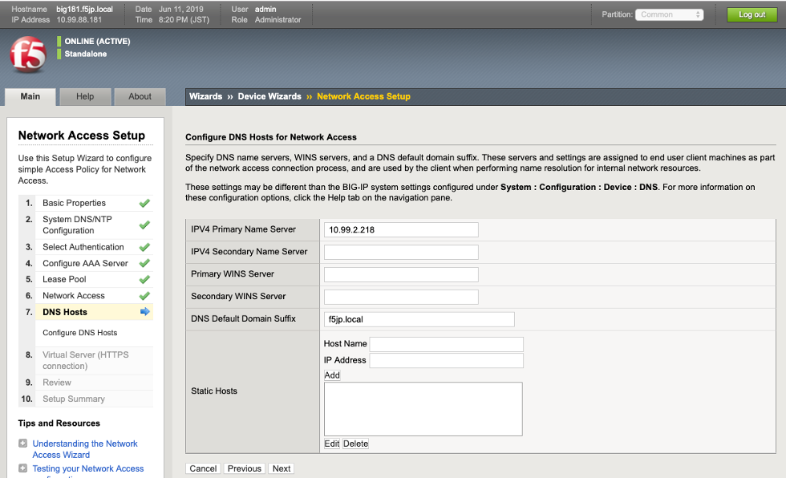

- IPv4 Primary Name Server : 10.99.2.218
- DNS Default Domain Suffix : f5jp.local
- クライアントPCのPPPアダプタで、SSL-VPNトンネル確立後に割り当てられるDNSサーバとDNSサフィックスを指定します。※ここに指定したDNSサフィックス宛の通信（f5jp.local）は、このDNSサーバを利用する、という設定です。

(9)バーチャルサーバを設定し、「Next」を押します。

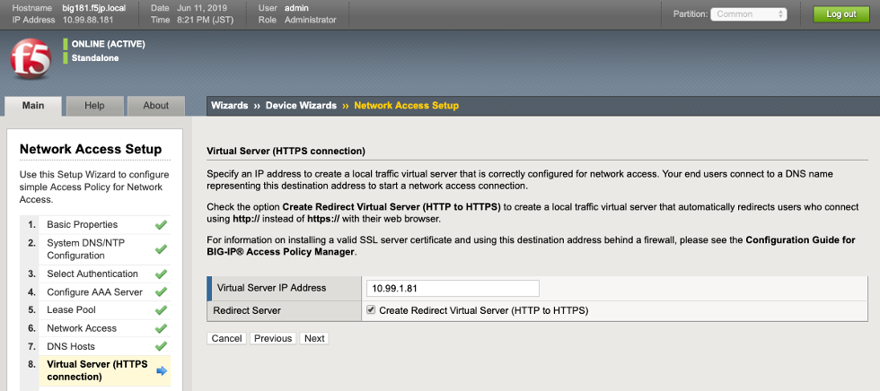

- Virtual Server IP Address : 10.99.1.81 / バーチャルサーバのIPアドレス
- Redirect Server : チェックする / このチェックボックスを有効にすることで、HTTP(80)でVirtual Serverへアクセスしても、自動的にHTTPS(443)へリダイレクトするVirtual Serverが生成されます。不要であれば、チェックを外してください。

(10)設定のレビューが表示されます。

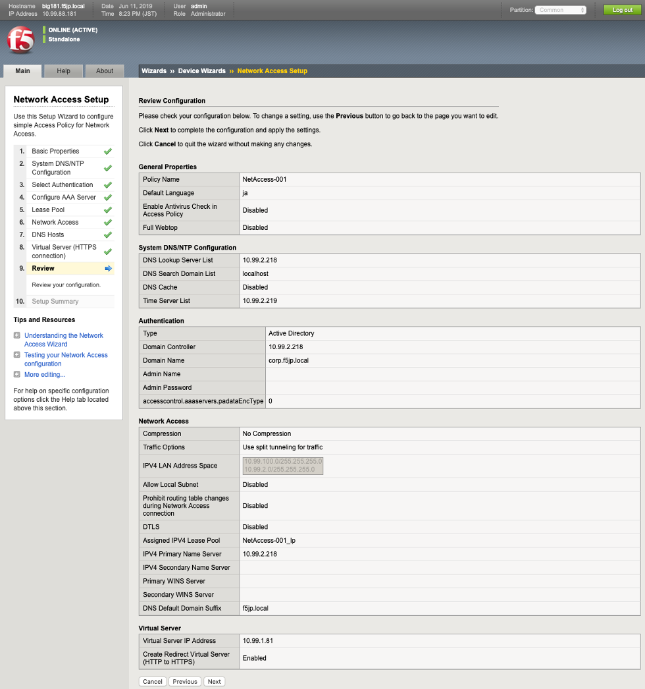

- 問題がなければ「Next」をクリックします。

(11)設定のサマリーが表示されます。

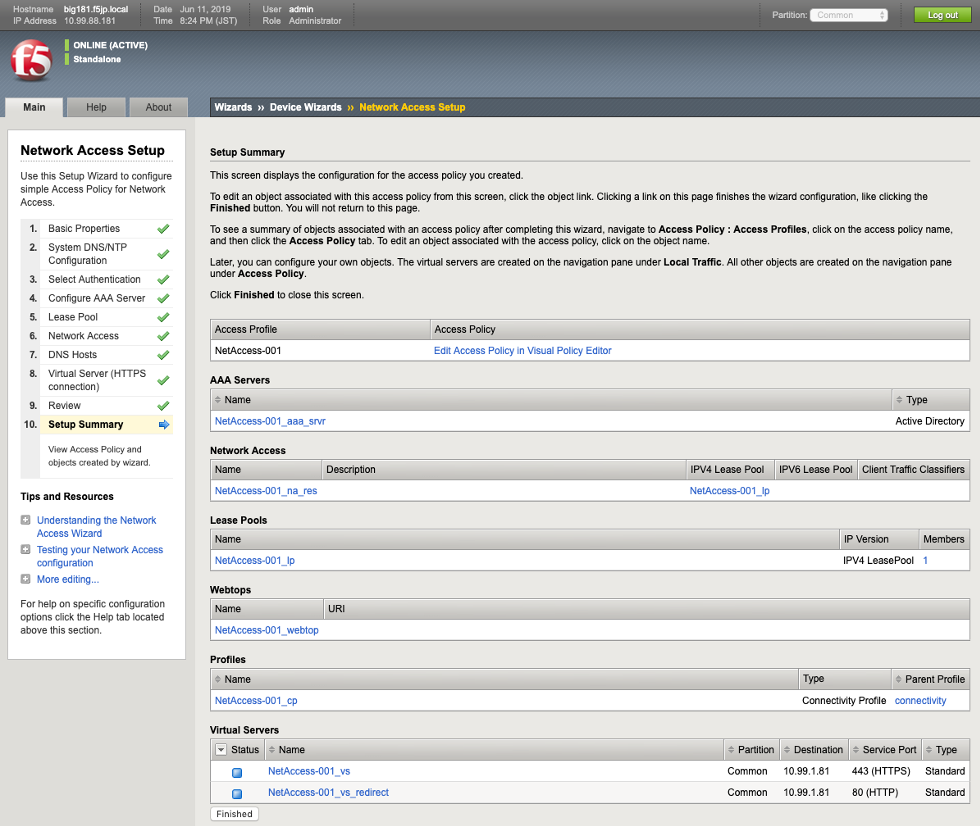

- 問題がなければ「Finish」をクリックします。
- 以上でネットワークアクセス設定は完了です。

**スプリット・トンネルとは**

| SSL-VPNトンネルを使う通信と、使わない通信を分けたいときに使います。
| 例えば、以下のような要件があったとします。
| 1.社内LANのサーバは10.99.2.0/24と10.99.100.0/24に設置されているので、それらはSSL-VPNトンネルを使いたい。
| 2.しかし、同時にインターネットも使いたい。
| このような要件を実現するのがスプリット・トンネルです。

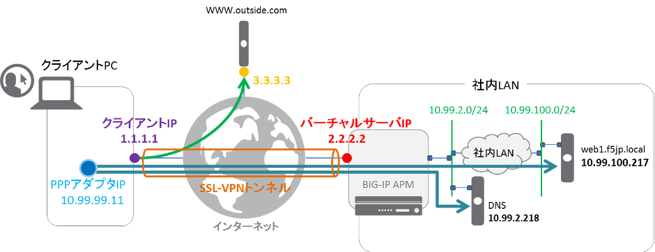

「Use split Tunnelling for Traffic」を選択し、トンネルに向かわせたいネットワーク帯（10.99.2.0/24，10.99.100.0/24）を指定することで、そのネットワークだけはSSL-VPNトンネルを通り、それ以外は、クライアントIP（上図の1.1.1.1）を使ってインターネット（上図3.3.3.3のwebサーバへの通信）を使う、ということが可能になります。