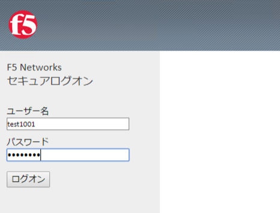
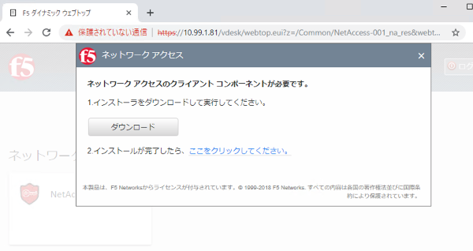
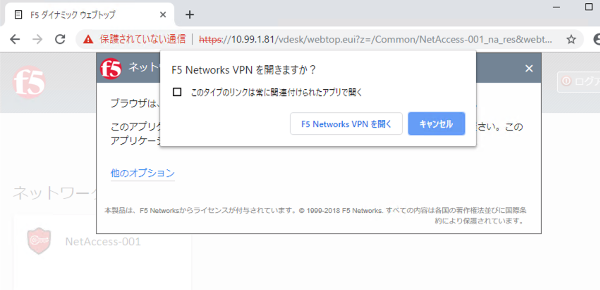
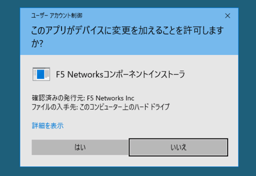
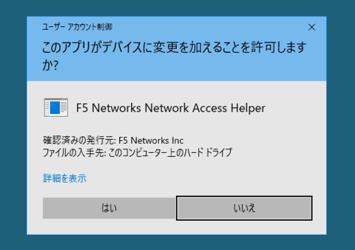
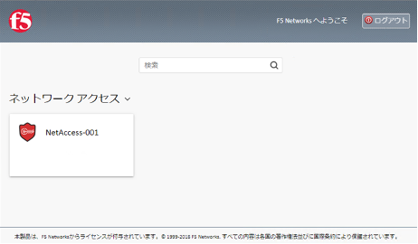
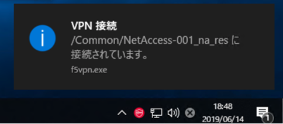

クライアントからのアクセス
===========================

SSL-VPN接続には、専用のクライアントソフトウェア（Edge Client）を利用した方法とWebブラウザからアクセスする方式（F5 Helper Application）の２種類あります。ここでは、Webブラウザから接続する方法を試します。

**WindowsのWebブラウザからのアクセス**

クライアントPCのWebブラウザから、設定したVirtual Serverへアクセスします。
Windows 10 + Chromeを使った場合の例です。

(1)認証フォーム画面が現れますのでActive Directoryに登録されているユーザ名とパスワードを入力します。

(2)初回アクセス時には、SSL-VPNクライアント用のクライアントコンポーネントをインストールする必要があります。ダウンロードボタンを押して、実行します。
| （インストールには管理者権限が必要となります。）

(3)インストールが終了したら、”ここをクリックしてください。”をクリックして、F5 Network VPNを開き、ブラウザの信頼済みサイトのセキュリティ警告を許可します。

(4)F5 Networksコンポーネントインストーラの利用を許可します。（Windowsのユーザアカウント制御の設定によって、表示の有無が変わります。）

(5)F5 Networks Networks Access Helperの利用を許可します。（Windowsのユーザアカウント制御の設定によって、表示の有無が変わります。）

(6)認証完了後、左下の画面が表示され、タスクバーにF5 Helper Applicationのアイコンが表示されます。

(7)Webブラウザから、以下の宛先へ直接通信ができることを確認します。
| ①	http://10.99.100.215	
| ②	http://10.99.100.217
| また、上記IPアドレスにSSH接続（ポート22番）できることを確認します。

- 〈ご参考〉
| F5 Helper Applicationのアンインスールは、コントロールパネルのアプリの（アン）インストール機能より行います。 “BIG-IP Edge Client Components”をアンインストールします。ここでは、引続きクライアントを利用するため、アンインストールは行いません。
