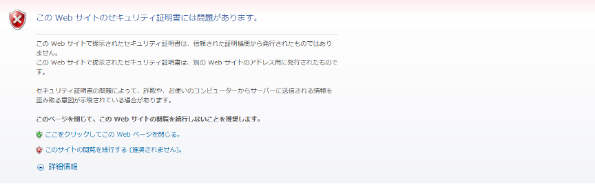
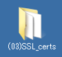

SSLサーバ証明書の設定
===========================

BIG-IPが持つデフォルトのサーバ証明書は、正式な認証局で取得したものではないため、クライアントPCのWebブラウザでVirtual Serverへアクセスすると、以下のような警告が出ます（IEの場合の例）。

以降、正式な認証局(例：Verisign，CyberTrust等)にて署名されたサーバ証明書をインポートして利用するまでの手順を示します。

**F5LABで利用するサーバ証明書**

| 一般的には、BIG-IPのGUIでCSRと秘密鍵を生成し、CSRを認証局（例：ベリサイン等）に送付します。そのCSRに対して、認証局が署名を行うことでサーバ証明書が完成します。そのサーバ証明書を返送してもらい、インポートします。
| 本ガイドでは簡易的に、秘密鍵ファイルとサーバ証明書の両方がすでに存在しているものとし、両方をインポートする手順とします。
| リモートデスクトップ接続したPCのデスクトップ上にある、以下のフォルダを開いてください。

このフォルダ内の以下2つのファイルを使用します。

| ①	秘密鍵ファイル：		abcCompany-key.pem
| ②	サーバ証明書ファイル：	abcCompany-cert.pem

