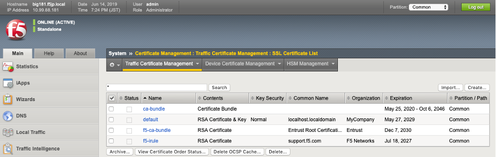
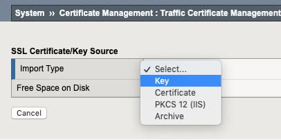
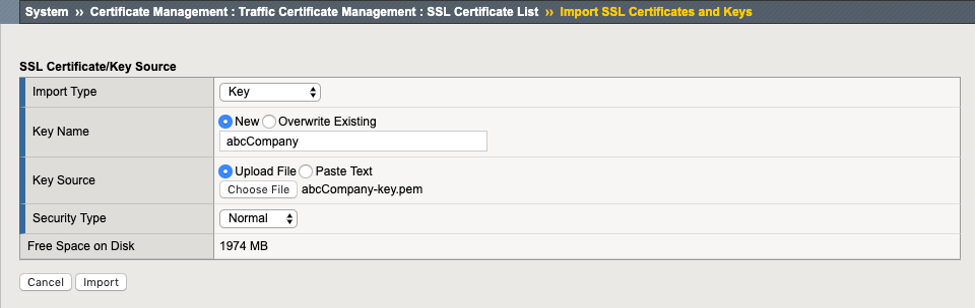
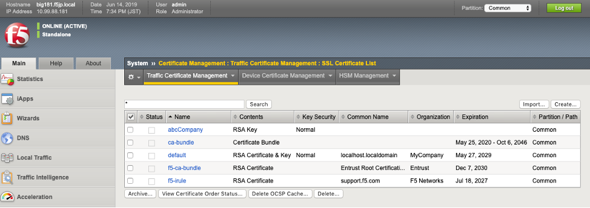
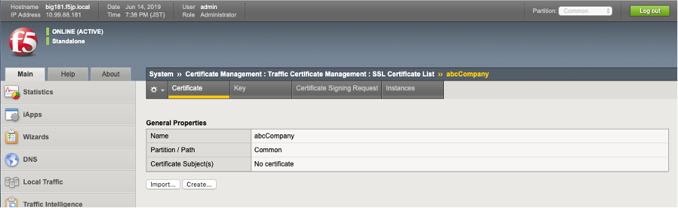
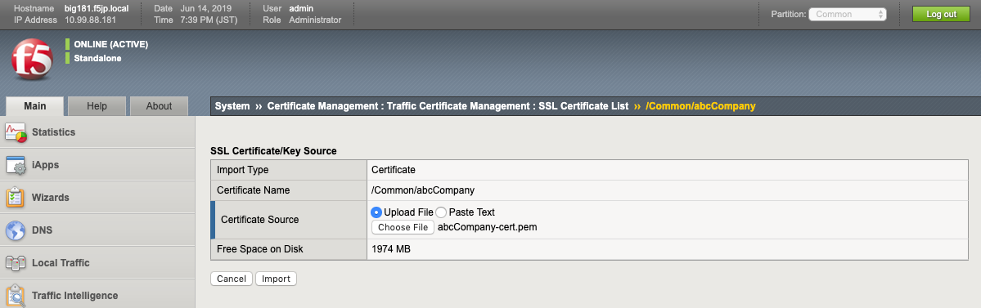
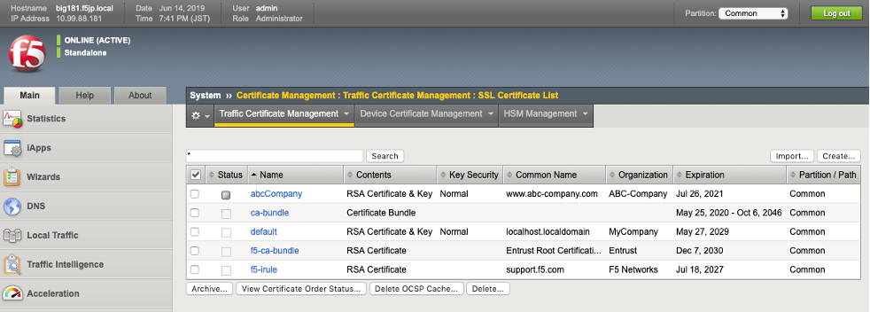

SSLサーバ証明書の設定
===========================

BIG-IPが持つデフォルトのサーバ証明書は、正式な認証局で取得したものではないため、クライアントPCのWebブラウザでVirtual Serverへアクセスすると、以下のような警告が出ます（IEの場合の例）。

.. image:: images/mod4-3-1.png
   :scale: 40%

以降、正式な認証局(例：Verisign，CyberTrust等)にて署名されたサーバ証明書をインポートして利用するまでの手順を示します。

**F5LABで利用するサーバ証明書**

| 一般的には、BIG-IPのGUIでCSRと秘密鍵を生成し、CSRを認証局（例：ベリサイン等）に送付します。そのCSRに対して、認証局が署名を行うことでサーバ証明書が完成します。そのサーバ証明書を返送してもらい、インポートします。
| 本ガイドでは簡易的に、秘密鍵ファイルとサーバ証明書の両方がすでに存在しているものとし、両方をインポートする手順とします。
| リモートデスクトップ接続したPCのデスクトップ上にある、以下のフォルダを開いてください。

.. image:: images/mod4-3-2.png
   :scale: 40%

このフォルダ内の以下2つのファイルを使用します。

| ①	秘密鍵ファイル：		abcCompany-key.pem
| ②	サーバ証明書ファイル：	abcCompany-cert.pem

**秘密鍵とサーバ証明書のインポート**

(1)サーバの秘密鍵をインポートします。 「System」 → 「Certificate Management」 → 「Traffic Certificate Management」 →「SSL Certificate List」で表示された画面右上の「Import」ボタンを押します。

(2)Keyを選択します。

(3)以下のように設定します。

- Key Name: Key の名称（任意）を指定
- Key Source: Key ファイルを Upload

(4)以下の状態になります。

(5)次にサーバ証明書をインポートします。インポートした秘密鍵をクリックすると、以下の画面が現れます。「Import」ボタンを押します。

(6)以下のように設定（インポート）します。

- Certificate Source: サーバ証明書ファイルを Upload

(7)サーバ証明書がインポートされた状態です。

