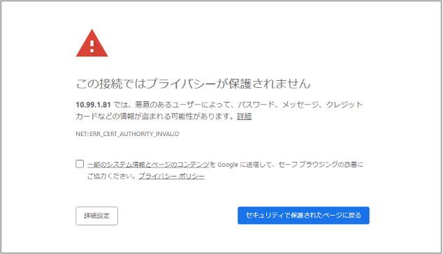
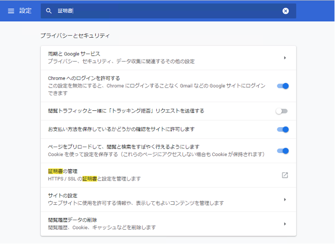
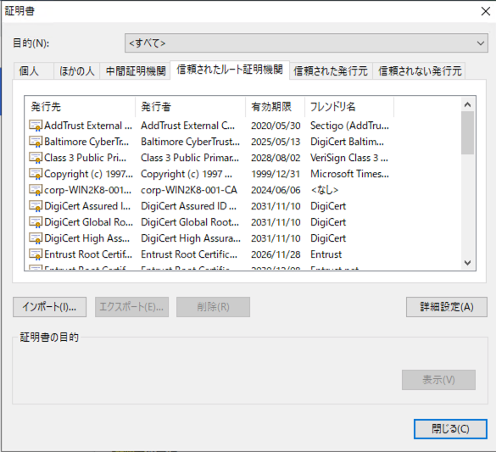
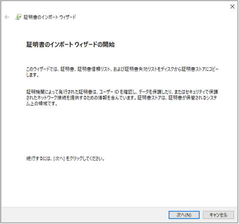
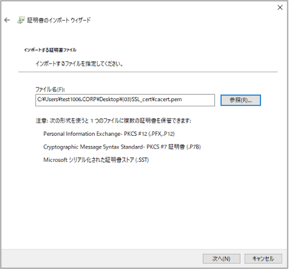
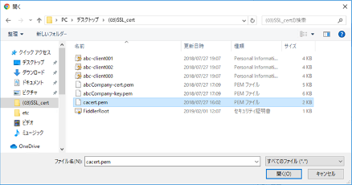
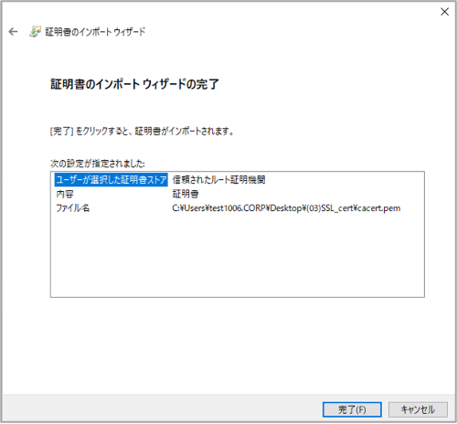
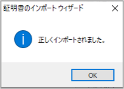
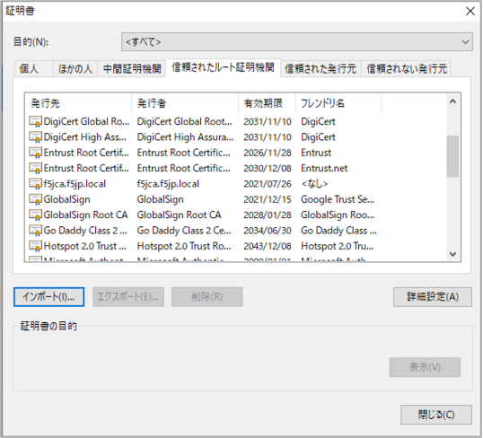

クライアントPCの設定
===========================

**認証局の証明書のインポート**

(1)	サーバ証明書をBIG-IPにインポートしただけでは不十分です。このままですと、まだ以下の画面を見ることになります。（例：Chrome）

この画面が出る理由は、このWebサイト（= BIG-IPのVirtual Server）のサーバ証明書に署名した認証局（F5J-CA）の証明書（ルート証明書）がWebブラウザにインポートされていないことが原因です。認証局の証明書がWebブラウザに入っていないと、サーバ証明書の発行元をチェックすることができないためです。
この問題を回避するために、認証局（F5J-CA）の証明書（ルート証明書）を、クライアントPCのWebブラウザへインポートする必要があります。

リモートデスクトップ接続したPCのデスクトップ上にある、以下のフォルダを開いてください。

このフォルダ内の以下のファイルを使用します。
-　認証局ファイル：	cacert.pem

以下の手順でクライアントPCのWebブラウザ (例：Chrome) へインポートします。

(2)	クライアントPCのWebブラウザ （例：Chrome）へインポートします。Chromeの設定画面で、証明書の管理を選択します。

(3)	「信頼されたルート証明機関」タブを選択し、「インポート」ボタンを押して下ださい。

(4)	「次へ」を押して下さい。

(5)	インポートするファイルとして、認証局の証明書：cacert.pemを選び、「次へ」を押してください。

pemファイルはデフォルトでは表示されないかもしれません。その場合は、左下の「すべてのファイル（*.*）」を選択して下さい

(6)	証明書ストアが「信頼されたルート証明機関」であることを確認し、「次へ」を押してください。

.. image:: images/mod4-4-8.png
   :scale: 40%

(7)	「完了」を押してください。

(8)	セキュリティ警告に承認し、下記の画面で「OK」を押してください。

(9)	「信頼されたルート証明機関」に、(f5jca.f5jp.local)のルート証明書がインポートされました。

これで、「信頼されたルート証明機関」として、本ガイドの認証局（F5J-CA）が登録されました。基本的にはこれで証明書のセキュリティ警告は表示されなくなります。

しかし、DNSによる名前解決ができない環境においては、次のステップも必要です。
